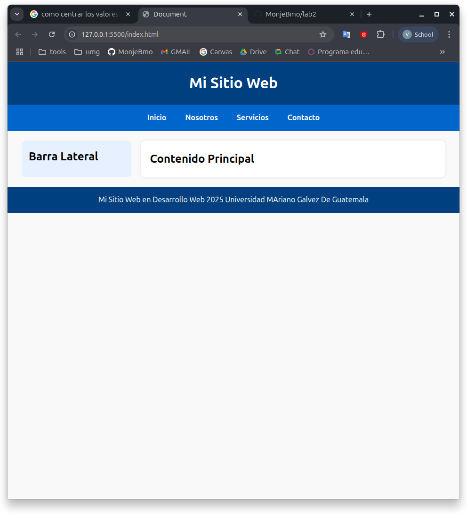

# 🌐 Lab 2 - Sitio Web Básico

Este es un proyecto de laboratorio para la clase de **Desarrollo Web 2025** de la **Universidad Mariano Gálvez de Guatemala**.

## 📝 Descripción

Un sitio web sencillo que contiene:

- `Header` con título del sitio
- `Navbar` con enlaces principales
- `Aside` como barra lateral
- `Section` para contenido principal
- `Footer` informativo

## 🎨 Tecnologías utilizadas

- HTML5
- CSS3 (Flexbox)
- Tipografía: `system-ui`, `Segoe UI`, `Roboto`, etc.

## 🖼️ Vista previa

---

